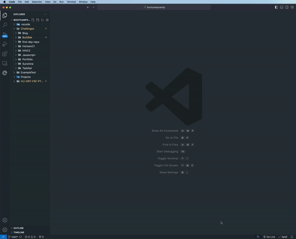

## Challenge 9 : Build Read Me

## Table of Contents
* [License](#license)
* [Description](#description)
* [Installation](#installation)
* [Usage](#usage)
* [Contributing](#contributing)
* [Test](#test)
* [Questions](#questions)

## License 

## Description
The object for this assignment is to create a README file through the process of package.json and utilizing javascript to input the code, while inputing key add-in like node, npm, and more.

## Installation 
NPM, inquirer to the file, adding file generate-markdown, along with utilizing fs.

## Usage 
The output of this file is in javascript and is created as a README (starter code was provided by bootcamp).

## Contributing 
The purpose of this file is to help create a professional README.md file correctly each time for this project and future. Code: Javascript | Issue: Please use terminal for any issues | Review: Code will be reviewed through Edx Central Grader | License and copyright: N/A .

## Test
Open folder Build-Me, Open Integrated Terminal (Or Use Terminal), Utilize Node, Follow Prompts

## Questions
Github: One4TheNation
Email: pnnavarre@gmail.com
